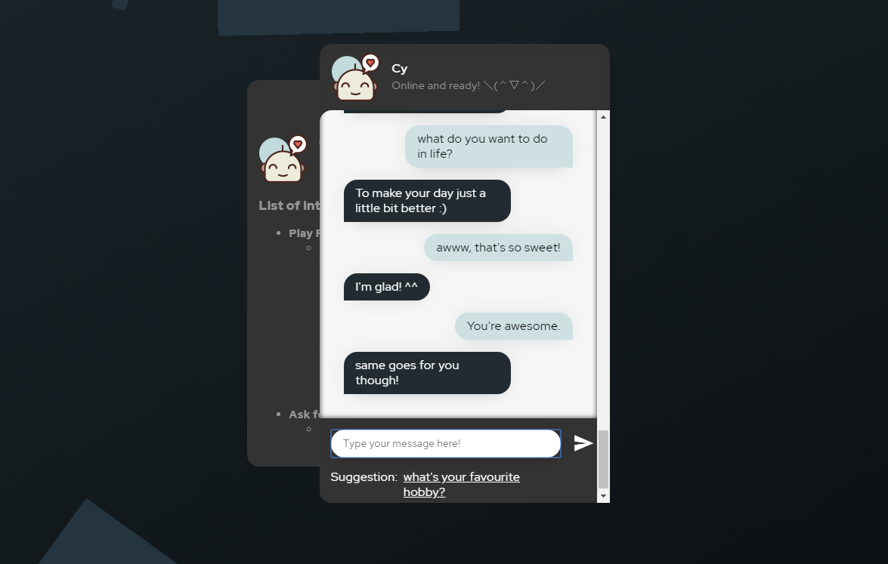
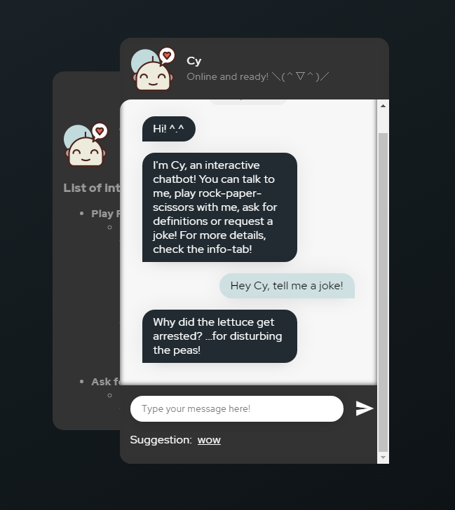
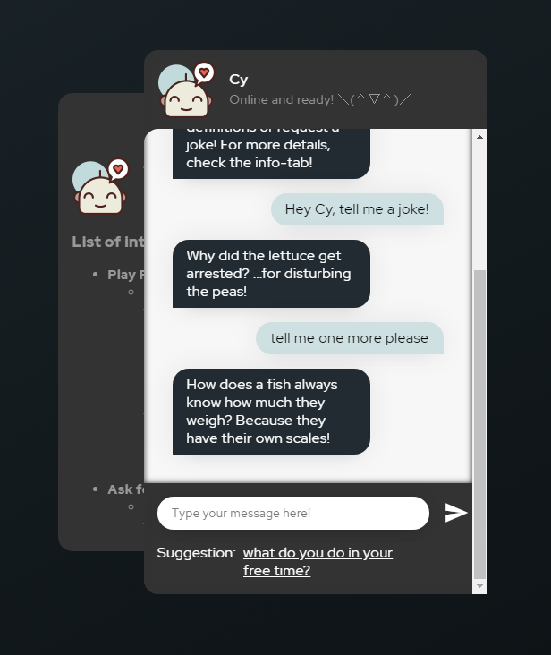
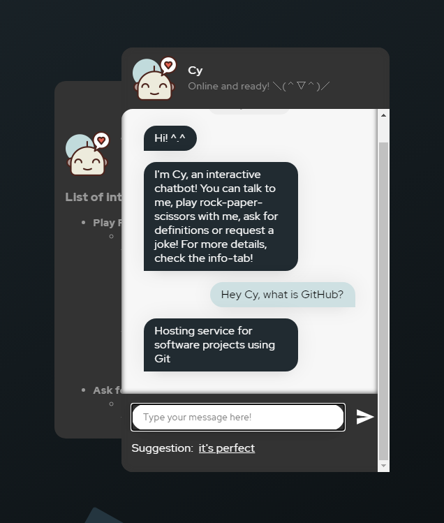
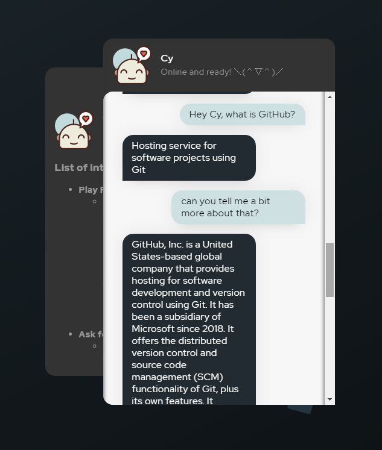
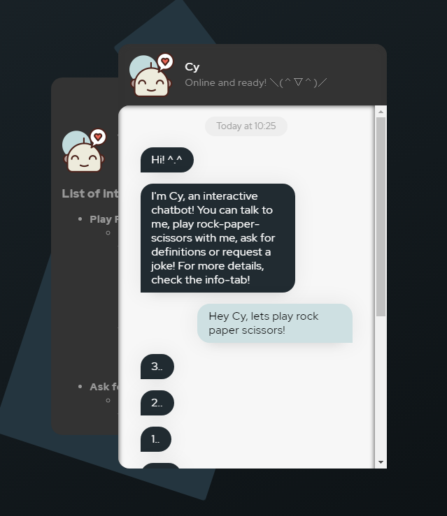
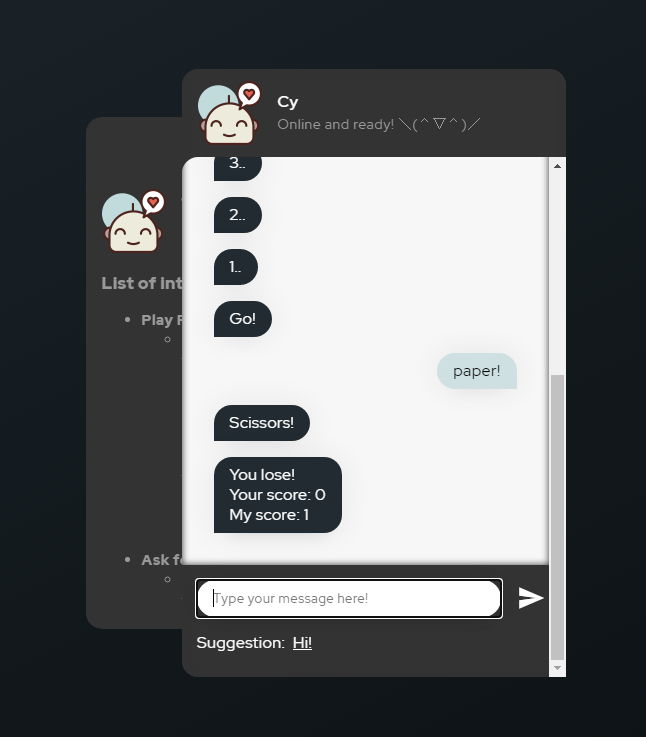
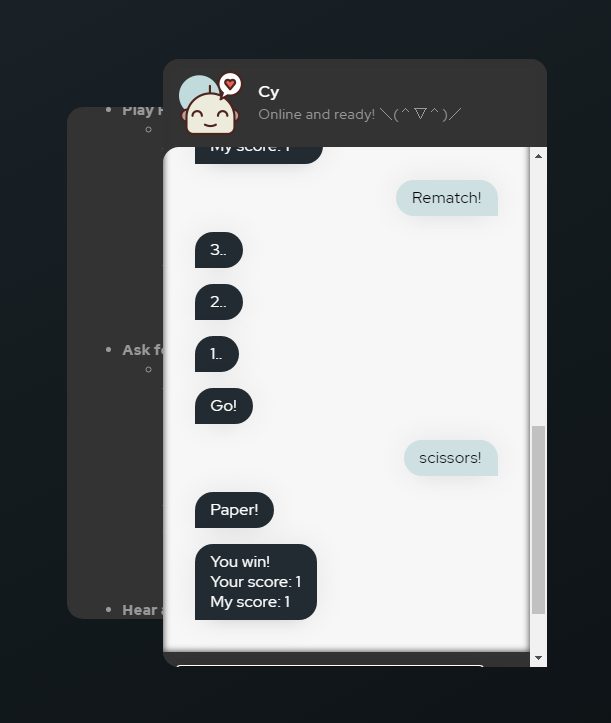

# Chatbot with Tensorflow.js

  

## **For a live web-demo of this chatbot click [here.](https://borisgiba.github.io/chatbot/)**

- [Chatbot with Tensorflow.js](#chatbot-with-tensorflowjs)
  - [**For a live web-demo of this chatbot click here.**](#for-a-live-web-demo-of-this-chatbot-click-here)
  - [Functionality](#functionality)
  - [Interactions](#interactions)
    - [Ask for a joke!](#ask-for-a-joke)
    - [Ask for a definition!](#ask-for-a-definition)
    - [Play rock paper scissors!](#play-rock-paper-scissors)
  - [Dataset](#dataset)
  - [UI](#ui)

## Functionality

The intention behind this project was to create an interactable chatbot using only tensorflow.js for the output-predictions.
A very sophisticated chatbot can be created utilizing BERT or GPT-2 or similarly large models,
however training those models as well as providing a web-interface to showcase the created chatbot would be very resource-heavy tasks.
For those reasons I chose an intent-based model, which tries to match the user-input to a certain "intent" and then chooses one of multiple pre-defined answers.
This, of course, is not nearly as exciting as a generative approach (I may return to that idea in the future),
however, this variant is very light and resource-efficient.

## Interactions

### Ask for a joke!
Cy knows a lot of them..

   

### Ask for a definition!
He knows everything and can even provide a summary!

   

### Play rock paper scissors!
Seems like he won the first time.. but I got my revenge! :D

    

Think *you* can outsmart Cy? You can try.. ;)

## Dataset
The Dataset containing all of the question-reply-pairs can be downloaded from this GitHub-repo (see /data/dataset).
The dataset used for training this chatbot is based on [this](https://github.com/Machine-Learning-Tokyo/seq2seq_bot) as well as [this](https://github.com/Bhargava-Sai-P/Chatbot-using-nltk) project.
However, the data was heavily reorganised, restructured and expanded on completely by hand. About 50% of the examples were cut and a large amount of own data points (questions, as well as answers) was added manually.
The list of jokes was taken from [here](https://github.com/amoudgl/short-jokes-dataset).

## UI
The UI of the web-demo is based on [this](https://codepen.io/mubangadv/pen/rXrOQa") codepen,
it was however heavily modified and extended.
The chatbot-icon was taken from [here](https://www.flaticon.com/de/kostenloses-icon/glucklich_1793433).
